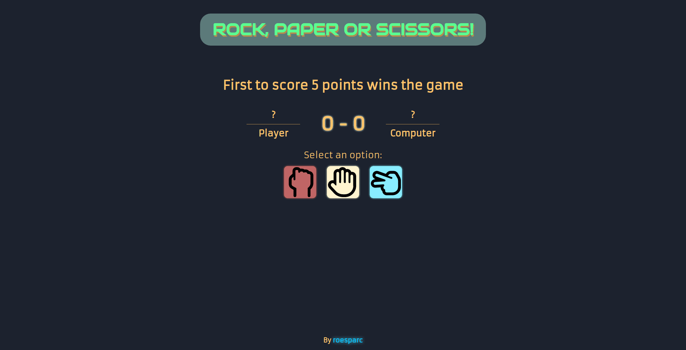

# Rock Paper Scissors

## [Live Demo](https://roesparc.github.io/Rock-Paper-Scissors/)

The purpose of this project is to build the DOM using only Vanilla JS.

### Features

- Play against the computer
- The computer makes a rondom move each turn
- Scoreboard keeps track of rounds won by each side
- The winner is announced once 5 points are reached by one side
- Play again button that restarts scoreboard and enables options again
